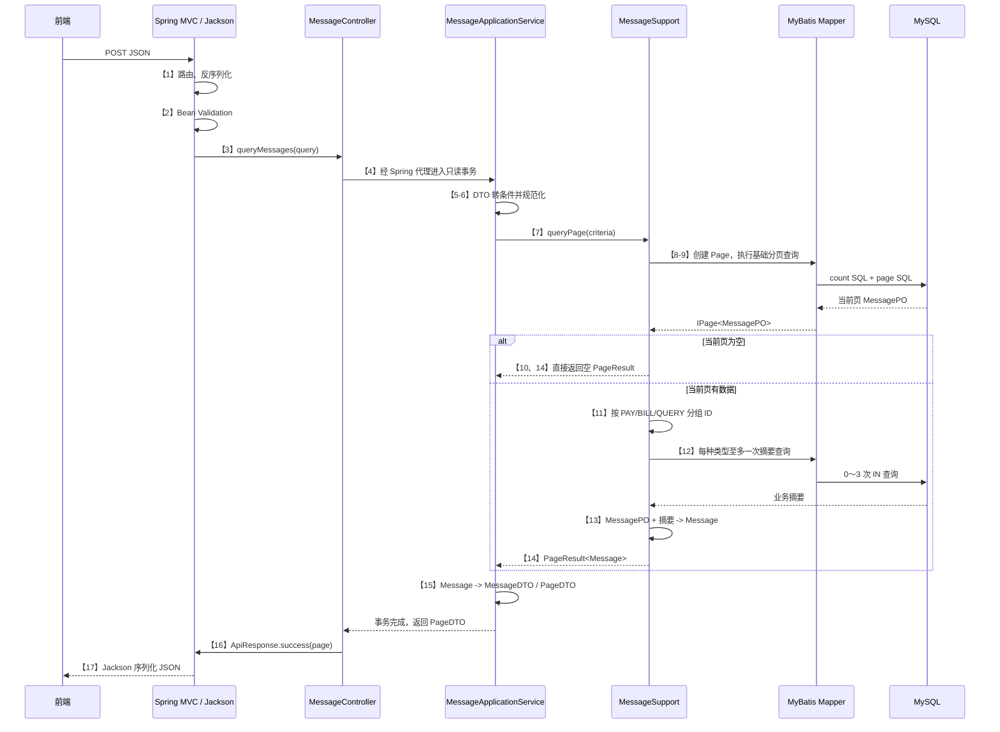

# `/api/example/v1/messages/query` 调用链学习指南

本文对应源码中的 `【1:...】` 到 `【17:...】` 注释。接口的完整地址是：

```http
POST /api/example/v1/messages/query
Content-Type: application/json
```

## 一次成功请求如何流动



## 编号与源码入口

| 编号 | 主要位置 | 作用 |
| --- | --- | --- |
| 【1】 | `MessageController.queryMessages`、`MessageQuery` | `DispatcherServlet` 根据注解路由；`RequestResponseBodyMethodProcessor` 使用 Jackson 把 JSON 转成请求 DTO。失败时方法体不会执行。 |
| 【2】 | `MessageQueryValidator.isValid` | `@Valid` 触发 Bean Validation。字段注解负责单字段格式，类级 `@ValidMessageQuery` 负责字段组合规则。约束的执行顺序默认不应被业务依赖。 |
| 【3】 | `MessageController.queryMessages` | Web 适配器进入方法体，只委派应用用例，不编写业务与 SQL。 |
| 【4】 | `MessageApplicationServiceImpl.queryMessages` | Spring AOP 事务代理在方法外建立只读事务，使分页主查询和摘要查询处在同一事务边界。 |
| 【5】 | `MessageAssembler.toCriteria` | MapStruct 编译期生成实现，把 HTTP 请求模型转换为领域查询条件。 |
| 【6】 | `MessageApplicationServiceImpl.normalizeCriteria` | 按业务时区换算自然日，清理空白，统一代码大小写，补默认排序。 |
| 【7】 | `MessageSupport.queryPage` | 应用层调用领域出站端口，不直接依赖 MyBatis。 |
| 【8】 | `MessageSupportImpl.queryPage` | 创建基础设施专用的 MyBatis `Page`，并声明需要精确总数。 |
| 【9】 | `MessageMapper.selectMessagePage`、`MessageMapper.xml` | Mapper 代理绑定 XML 动态 SQL；分页插件通常执行 count SQL 和带 `LIMIT` 的分页 SQL，再映射为 `MessagePO`。 |
| 【10】 | `MessageSupportImpl.queryPage` | 当前页为空就提前返回，避免无意义的业务摘要 SQL。 |
| 【11】 | `MessageSupportImpl.loadBusinessSummaries` | 仅把当前页 ID 按 `PAY/BILL/QUERY` 分组，`OTHER` 无业务金额摘要。 |
| 【12】 | `MessageSupportImpl.selectSummaries`、Mapper/XML | 每个出现的业务类型执行一次批量 `IN` 查询，总数为 0～3 次；解决逐条查询的 N+1 问题。 |
| 【13】 | `MessageConverter.toDomain` | MapStruct 将公共 `MessagePO` 与摘要合并成领域 `Message`，PO 不越过基础设施边界。 |
| 【14】 | `PageResult` | 把 MyBatis `IPage` 转成框架无关的领域分页结果。 |
| 【15】 | `MessageAssembler.toPageDTO` | 领域模型转接口 DTO，建立防止内部字段泄漏的响应边界。 |
| 【16】 | `ApiResponse.success` | Controller 添加统一业务成功码与响应信封。事务实际已在应用服务代理返回时完成。 |
| 【17】 | Spring MVC / Jackson | `HttpMessageConverter` 将返回对象序列化成 JSON 并写入 HTTP 响应。此步由框架完成，没有业务代码方法可直接进入。 |

## 每一层为什么存在

| 层 | 本接口中的类 | 应该负责 | 不应该负责 |
| --- | --- | --- | --- |
| Adapter / Web | `MessageController` | HTTP 路由、请求/响应协议、调用用例 | SQL、业务时区、跨表拼装 |
| Application API | `MessageApplicationService`、请求/响应 DTO | 对外声明用例与协议边界 | 数据库表结构 |
| Application Service | `MessageApplicationServiceImpl`、`MessageAssembler` | 用例编排、事务、规范化、边界对象转换 | HTTP 细节、MyBatis API |
| Domain | `Message`、`MessageQueryCriteria`、`MessageSupport`、`PageResult` | 表达业务概念与持久化需求抽象 | Spring MVC、Jackson、SQL |
| Infrastructure | `MessageSupportImpl`、`MessageMapper`、PO、XML | 实现领域端口、执行 SQL、PO/领域转换 | 决定 HTTP 返回结构 |

这里最值得理解的是依赖方向：应用服务依赖 `MessageSupport` 接口，而 `MessageSupportImpl` 反过来实现这个接口。
业务核心因此不需要知道 MyBatis 的存在，这也是依赖倒置原则在后端项目里的实际形态。

## 正常路径究竟执行几条 SQL

- 基础分页开启 `searchCount=true`，通常会执行 1 条 count SQL 和 1 条分页 SQL。
- 当前页为空：不会查询摘要，总计通常 2 条 SQL。
- 当前页只有一种结构化业务类型：再执行 1 条摘要 SQL，总计通常 3 条。
- 当前页同时包含 `PAY`、`BILL`、`QUERY`：各执行 1 条摘要 SQL，总计最多通常 5 条。
- 金额、币种或交易号参与筛选时，基础 SQL 会用 `EXISTS` 访问指定业务表；这是基础 SQL 的子查询，不是 Java 侧额外一次往返。

“通常”是因为 MyBatis-Plus 在无需 count、count 被优化或分页配置变化时，实际 SQL 数可能不同。学习时应以 SQL 日志为准。

## 异常路径

1. JSON 语法、枚举或日期格式错误：第 1 步失败，进入 `handleUnreadableMessage`，Controller 方法体未运行。
2. 单字段或跨字段校验错误：第 2 步失败，进入 `handleMethodArgumentNotValid`，应用服务未运行。
3. 明确业务异常：由 `handleBusinessException` 转为 HTTP 400 和稳定业务码。
4. 数据库连接、SQL 等未预期异常：事务拦截器结束事务，异常继续传播到 `handleUnexpectedException`，服务端记录堆栈，客户端只收到通用 500。

全局异常处理器的价值不是“吞掉异常”，而是把内部异常模型翻译成稳定、安全的 HTTP 协议。

## 建议这样调试一遍

1. 在 `MessageController.queryMessages` 打断点，确认合法请求经过第 1、2 步后才进入方法体。
2. 在 `MessageQueryValidator.isValid` 打断点，分别提交合法与非法的字段组合。
3. 在 `normalizeCriteria` 观察 UTC 边界如何转换成 `Asia/Shanghai` 的 `LocalDate`，并观察空字符串如何变成 `null`。
4. 在 `MessageSupportImpl.queryPage` 观察 `Page`、`IPage`、`MessagePO`、`Message` 四种对象为何不能混用。
5. 打开 `com.wlbcmbchina.manager` 的 MyBatis SQL 日志，比较空页、单一业务类型和三种业务类型时的 SQL 数量。
6. 到 `target/generated-sources/annotations` 查看 MapStruct 生成的 `MessageAssemblerImpl` 与 `MessageConverterImpl`。不要手改生成文件，它们会在下次编译时覆盖。

## 可以继续学习的关键点

- **Spring MVC 参数解析链**：`@RequestBody`、Jackson、`@Valid` 分别在 Controller 方法前做了什么。
- **Spring AOP 代理与事务**：为什么从 Spring Bean 外部调用才会经过 `@Transactional`；直接 `new MessageApplicationServiceImpl(...)` 或同类内部自调用不会自动开启事务。
- **DTO、Domain、PO 的区别**：三个对象看似字段重复，却分别保护接口、业务和数据库边界。
- **MyBatis 动态 SQL 与参数绑定**：值使用 `#{}` 绑定；排序列不能用未经校验的 `${}` 拼接，本项目通过枚举白名单和 `<choose>` 规避注入。
- **分页一致性**：主查询与摘要查询之间如果数据变化，可能得到不一致快照；只读事务提供边界，但最终一致性仍取决于数据库事务隔离级别。
- **N+1 与有界批量查询**：本接口不是把所有表一次 JOIN，也不是逐条查询，而是在当前页范围内按类型批量读取。
- **索引与可检索类型**：金额若存成 `VARCHAR`，`CAST` 会影响索引利用；更合适的物理类型是经过业务确认的 `DECIMAL`。
- **测试分层**：Controller 测试验证 HTTP 契约，Application Service 测试验证编排与规范化，Repository 测试验证批量补齐策略；真实 SQL 还应增加连接测试数据库的集成测试。
